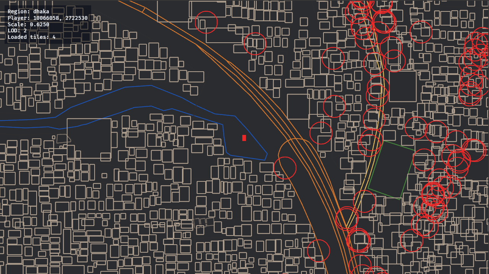

# Bangladesh
A 2d RPG game with 1:1 map of Bangladesh built using Bevy/Rust.

The game uses OSM data for the map. Many details are simplified to make it more playable, but the overall layout of the country is preserved.

Still a concept project, but I hope to add more features and content in the future.
For now only a flat top down view is available.

